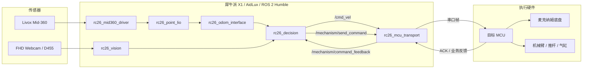
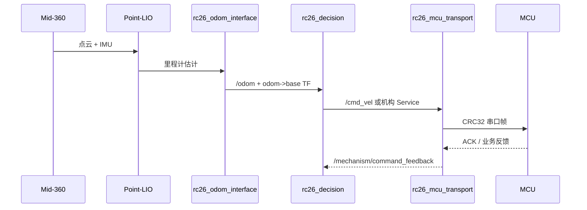
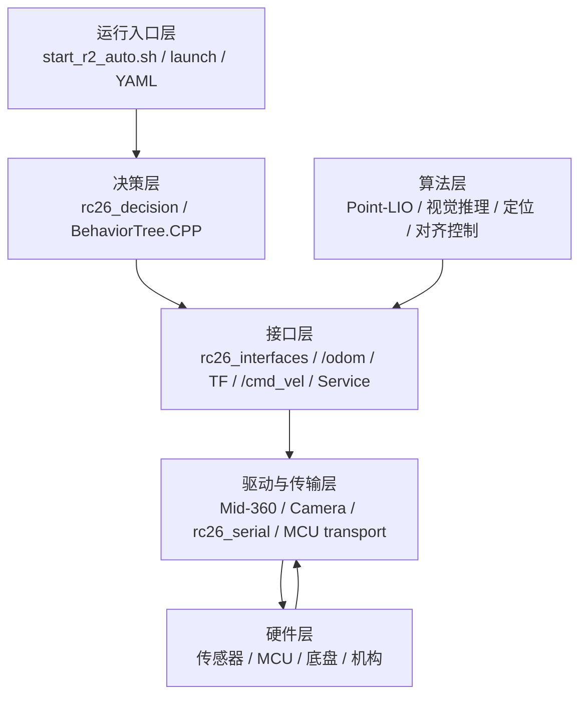

# RC_2026 - R2 自动机器人 ROS 2 运行时

> **本项目由西华大学创界 RC 战队视觉算法组开源。**
>
> 仓库面向 **R2 自动机器人**，`src/` 是 ROS 2 Humble 运行时工作区。根目录 `README.md` 是唯一公开说明入口；包内实现细节以源码、launch、配置、IDL、测试和 CI 为准。

> [!WARNING]
> 本项目会向真实底盘和机构发送运动指令。第一次启动、修改参数或切换运行模式前，请架空底盘或确保机器人处于可靠支撑状态，准备急停，清空运动区域，并确认只有一个节点发布 `/cmd_vel`。

## 评分项速览

| 评分项 | 本 README 对应章节 |
| --- | --- |
| 软件功能介绍 | [功能简介](#功能简介) |
| 软件效果展示 | [效果展示与创新优势](#效果展示与创新优势) |
| 依赖工具、软硬件环境 | [环境与依赖](#环境与依赖) |
| 编译、安装方式 | [编译与安装](#编译与安装) |
| 文件目录结构及用途 | [目录结构](#目录结构) |
| 软件与硬件系统框图、数据流图 | [系统框图与数据流](#系统框图与数据流) |
| 原理介绍与理论支持 | [原理与理论支持](#原理与理论支持) |
| 软件架构或层级图 | [软件架构](#软件架构) |
| RoadMap | [RoadMap](#roadmap) |
| 开源协议与第三方声明 | [开源许可](#开源许可) 与 [THIRD_PARTY_NOTICES.md](THIRD_PARTY_NOTICES.md) |

## 功能简介

`RC_2026` 是 R2 自动机器人的 ROS 2 运行时，用于把激光雷达、相机、里程计、行为树决策、底盘速度控制和 MCU 串口执行链连接成完整比赛闭环。

核心功能：

- **定位与里程计**：Livox Mid-360 点云和 IMU 经 Point-LIO 输出运动估计，再由 `rc26_odom_interface` 统一发布 `/odom` 和动态 TF。
- **确定性导航**：`rc26_decision` 使用 odom 相对闭环执行 X/Y/yaw 分段动作，不默认依赖 Nav2 地图规划链。
- **视觉感知与对齐**：`rc26_vision` 支持 YOLO 推理、目标锁定、深度采样和受限视觉对齐测试。
- **行为树决策**：BehaviorTree.CPP 编排预选赛、台阶、梅林等任务阶段和机构反馈等待逻辑。
- **底盘与机构执行**：`rc26_mcu_transport` 将 `/cmd_vel` 和机构 Service 转换为目标 MCU 串口协议，提供 ACK、业务反馈、重试和断线诊断。
- **实机运维入口**：根目录脚本提供自动比赛链、人工遥控测试链和 dry-run 安全检查。

## 效果展示与创新优势

### 公开演示

- [R2 第二预选赛赛场视频](https://www.bilibili.com/video/BV1TuNz6MEBm/)：展示第二预选赛任务链在赛场环境中的实际运行效果。
- [R2 第一预选赛测试视频](https://www.bilibili.com/video/BV1oSuM6VEdo/)：展示第一预选赛自动流程的测试运行效果。

当前方案已在真实 R2、犀牛派 X1/AidLux 和比赛场地上完成整车链路测试。公开仓库暂未附带可复算的真值轨迹、视觉标注集、通信时延日志或多轮任务统计，因此本 README 不虚构终点误差、yaw 误差、Precision、Recall、FPS、ACK 延迟或任务成功率。后续补充量化结果时，应同时提交测试场地、样本数量、硬件版本、软件提交、统计脚本和原始日志。

### 与旧 Nav2 链对比

| 对比维度 | 旧 Nav2 地图导航 | 当前 odom 相对闭环 |
| --- | --- | --- |
| 环境依赖 | 依赖现场 PCD、地图定位、代价地图和规划参数 | 默认只依赖新鲜 `/odom` |
| 路径生成 | 全局/局部规划器根据代价地图生成路径 | 行为树按比赛阶段调用 X/Y/yaw 确定性动作 |
| 调试成本 | 地图、定位、规划、控制器、速度平滑链较长 | Point-LIO、odom 接口、决策、MCU transport 最小闭包 |
| 适用任务 | 适合自由目标点规划和动态绕障 | 适合路线已知、动作可分段、强调现场确定性的比赛任务 |
| 安全边界 | 仍需实机安全验收 | 同样必须急停、架空和确认 `/cmd_vel` 唯一发布者 |

创新点与优势：

- **低耦合运行链**：把通用 LIO、可解释闭环控制、行为树和可靠串口执行组合成短链路。
- **低成本复用**：路线、红蓝方和比赛流程集中在 YAML 与行为树中，适合新队伍快速建立受控测试闭环。
- **权威边界清晰**：`/odom`、`/cmd_vel`、TF、机构 Service 和 MCU feedback 各有明确发布和消费边界。
- **不夸大指标**：公开演示与源码可核验的机制对比保留，尚无原始数据支撑的定量指标不写成实测结论。

## 环境与依赖

### 软件环境

| 层级 | 当前口径 |
| --- | --- |
| 操作系统 | Ubuntu 22.04 |
| ROS 发行版 | ROS 2 Humble |
| 实机融合环境 | AidLux，Android 13 + Ubuntu 22.04 |
| 构建系统 | colcon + ament_cmake + CMake |
| 主要语言 | C/C++、Python 3、Bash |
| 配置与编排 | YAML、ROS 2 launch、BehaviorTree.CPP XML |

### 主要硬件

| 硬件 | 用途 |
| --- | --- |
| 犀牛派 X1 / Qualcomm QCS8550 | R2 当前算力板卡 |
| Livox Mid-360 | 默认里程计主传感器，提供点云和 IMU |
| 麦克纳姆底盘 | 全向移动执行机构 |
| 目标 MCU | 接收串口帧，执行底盘和机构动作 |
| FHD Webcam | 当前 MC 端头视觉 |
| RealSense D455 | 按需深度视觉和 KFS 测试 |

### 依赖分层

- **基础必需依赖**：ROS 2 Humble、colcon、ament、PCL、Eigen、OpenCV、yaml-cpp、BehaviorTree.CPP 和标准 ROS 消息包。
- **算法构建依赖**：`rc26_point_lio` 当前要求 GTSAM 4.2.0；实验性闭环默认关闭时仍需要构建期依赖。
- **实机依赖**：Mid-360 网络、目标 MCU 串口、相机设备、传感器外参和 R2 实机参数。
- **可选视觉后端**：AidLite 与 ONNX Runtime C++。缺少二者时 `rc26_vision` 可通过 stub 构建，但实际推理会报无可用后端。

## 编译与安装

### 1. 准备 ROS 2

```bash
source /opt/ros/humble/setup.bash
```

### 2. 克隆仓库

```bash
cd /home/aidlux
git clone --branch main --single-branch \
  https://github.com/potato484/RC_2026.git RC_2026
cd /home/aidlux/RC_2026
```

若仓库放在其他目录，需检查红蓝配置中的 PCD、行为树和部署资产路径。公开克隆默认不包含现场先验点云 `src/rc26_point_lio/PCD/class_plus.pcd`。

### 3. 安装可解析依赖

```bash
rosdep install --from-paths src --ignore-src --rosdistro humble -r -y
```

`rosdep` 不会安装 AidLite、所有板端 SDK 或本项目指定口径的 GTSAM 源码版本；缺失时按对应上游说明安装。

### 4. 低并发构建

```bash
MAKEFLAGS='-j2 -l2' colcon build \
  --symlink-install \
  --executor sequential \
  --parallel-workers 1 \
  --packages-select \
  rc26_interfaces \
  rc26_serial \
  rc26_small_gicp \
  rc26_mid360_driver \
  rc26_sensor_extrinsics \
  rc26_point_lio \
  rc26_odom_interface \
  rc26_sensor_scan \
  rc26_localization \
  rc26_mcu_transport \
  rc26_vision \
  rc26_decision \
  rc26_telecontrol \
  rc26_bringup
source install/setup.bash
```

只修改部分包时，保持相同命令形式并缩小 `--packages-select` 列表。需要提速时优先小幅调高 `MAKEFLAGS`，不要直接提高 `--parallel-workers`。

## 目录结构

```text
RC_2026/
├── README.md              项目唯一公开说明入口
├── THIRD_PARTY_NOTICES.md 第三方组件、许可证和来源集中声明
├── LICENSE                根 MIT 许可证
├── LICENSE-APACHE         Apache-2.0 许可证副本
├── start_r2_auto.sh       R2 自动比赛链入口
├── start_r2_teleop.sh     R2 人工遥控测试入口
├── 开机自启动.txt         AidLux systemd 自启动说明
├── .github/workflows/     仓库级 CI
└── src/                   R2 ROS 2 Humble 工作区
```

`src/` 包职责：

| 包 | 用途 |
| --- | --- |
| `rc26_bringup` | 整车 launch、红蓝配置、运行模式装配 |
| `rc26_decision` | 行为树决策、odom 相对导航、比赛流程 |
| `rc26_interfaces` | 自定义消息与服务 IDL |
| `rc26_odom_interface` | Point-LIO 结果到统一 `/odom` 和 TF 的接口 |
| `rc26_point_lio` | Point-LIO 里程计与点云建图能力 |
| `rc26_mid360_driver` | Mid-360 驱动接入 |
| `rc26_mcu_transport` | `/cmd_vel` 与机构 Service 到 MCU 串口帧 |
| `rc26_serial` | 串口协议、CRC、ACK、重试、重连基础库 |
| `rc26_vision` | YOLO 推理、目标定位、深度采样、视觉对齐测试 |
| `rc26_localization` | 可选先验地图重定位 |
| `rc26_sensor_scan` | 传感器点云坐标转换与 TF |
| `rc26_sensor_extrinsics` | R2 传感器外参配置 |
| `rc26_telecontrol` | 手柄遥控底盘和推杆测试 |
| `rc26_small_gicp` | small_gicp 点云配准库适配 |

## 系统框图与数据流

### 软硬件系统框图



### 主数据流



## 软件架构



设计模式与工程约束：

- 行为树用于流程编排，动作节点负责可取消、可超时、可诊断的执行单元。
- ROS 2 topic/service/TF 用作模块契约，避免决策层直接依赖串口帧和传感器驱动内部状态。
- 推理后端采用 resolver/factory 风格，支持 AidLite、ONNX Runtime 或 stub 构建。
- 串口层将 transport ACK 与业务反馈拆开，避免把“收到命令”等同于“机构动作完成”。

## 原理与理论支持

### LiDAR-IMU 里程计

Point-LIO 使用 IMU 做高频状态传播，并用 LiDAR 点到局部平面的几何残差校正漂移。可用状态向量概括：

$$
\mathbf{x}=\left(\mathbf{R},\mathbf{p},\mathbf{v},\mathbf{b}_g,\mathbf{b}_a,\mathbf{g}\right)
$$

典型点到平面残差：

$$
r_i=\mathbf{n}_i^{\mathsf T}\left(\mathbf{R}\mathbf{p}_i+\mathbf{t}-\mathbf{q}_i\right)
$$

`rc26_point_lio` 输出上游估计，`rc26_odom_interface` 将结果整理为统一 `/odom` 和 `odom -> base_footprint -> base_link`，为当前无默认先验地图的相对导航提供运动反馈。

### odom 相对闭环

`OdomDriveX`、`OdomDriveY` 在动作开始时记录起点 $\mathbf{p}_0=(x_0,y_0)$ 和起始 yaw $\theta_0$。给定车体系目标 $\Delta\mathbf{p}_b=(\Delta x_b,\Delta y_b)$，目标点转换为：

$$
x_t=x_0+\cos\theta_0\Delta x_b-\sin\theta_0\Delta y_b
$$

$$
y_t=y_0+\sin\theta_0\Delta x_b+\cos\theta_0\Delta y_b
$$

轴向速度采用带容差、最小有效速度和最大限幅的比例控制：

$$
v_s=\mathrm{sgn}(e_s)\mathrm{clip}\left(K_p|e_s|,v_{\min},v_{\max}\right)
$$

角度误差归一化到最短转向区间：

$$
e_{\theta}=\mathrm{atan2}(\sin(\theta_t-\theta),\cos(\theta_t-\theta))
$$

只有位置误差、yaw 误差连续若干 tick 同时进入容差才返回成功；odom 超龄、动作超时、节点 halt 或上下文异常都会发布零速度。

### 视觉目标对齐

目标框中心为 $u_c$，图像宽度为 $W$，目标线偏置为 $u_o$，像素误差为：

$$
e_u=u_c-\left(\frac{W}{2}+u_o\right)
$$

横移控制根据相机安装方向选择符号并限幅：

$$
v_y=-\sigma\mathrm{sgn}(e_u)\mathrm{clip}\left(K_u|e_u|,v_{y,\min},v_{y,\max}\right),\quad \sigma\in\{-1,1\}
$$

视觉动作只通过 `/cmd_vel` 和机构 Service 执行，不绕过 transport 直接操作硬件。

### 串口可靠传输

串口帧包含帧头、`seq`、长度、重发次数、命令、payload、CRC32 和帧尾。CRC32 检测传输错误，`seq` 匹配 ACK 与业务反馈。可靠命令的 ACK 超时采用指数加权估计：

$$
\mathrm{SRTT}_k=(1-\alpha)\mathrm{SRTT}_{k-1}+\alpha R_k,\quad \alpha=\frac{1}{8}
$$

ACK 只表示 MCU 接收命令，不代表机构动作完成；动作完成由 `/mechanism/command_feedback` 中对应 `feedback_id` 与 `seq` 判定。

## 运行入口

### 自动比赛链

```bash
./start_r2_auto.sh --dry-run
./start_r2_auto.sh
./start_r2_auto.sh --use-realsense
./start_r2_auto.sh --use-rviz
```

### 人工遥控测试

```bash
./start_r2_teleop.sh --dry-run --require-deadman
./start_r2_teleop.sh --require-deadman
```

遥控前必须停止自动决策和其它 `/cmd_vel` 发布者。

### KFS 视觉测试

```bash
source install/setup.bash
ros2 launch rc26_vision test_kfs_vision.launch.py action_enable:=false
```

`action_enable:=true` 会进入真实底盘/机构测试链，只能在停用自动决策、遥控和其它 `/cmd_vel` 发布者后使用。

## 关键接口

| 接口 | 类型 | 生产者 | 消费者 | 用途 |
| --- | --- | --- | --- | --- |
| `/odom` | `nav_msgs/msg/Odometry` | `rc26_odom_interface` | `rc26_decision` 等 | 统一里程计输入 |
| `/cmd_vel` | `geometry_msgs/msg/Twist` | 决策、遥控或测试动作 | `rc26_mcu_transport` | 底盘速度意图 |
| `odom -> base_footprint -> base_link` | TF | `rc26_odom_interface` | 坐标变换消费者 | 动态基座坐标权威 |
| `/mechanism/send_command` | `rc26_interfaces/srv/SendMechanismTransportCommand` | 决策或测试节点 | `rc26_mcu_transport` | 机构命令下发 |
| `/mechanism/command_feedback` | `rc26_interfaces/msg/MechanismTransportFeedback` | `rc26_mcu_transport` | 决策、视觉测试 | MCU 业务反馈 |
| `/vision/tip_detections` | `rc26_interfaces/msg/TipDetectionArray` | `rc26_vision` | 外部只读消费者 | 端头检测输出 |

接口字段、类型和精确语义以 `src/rc26_interfaces/`、相关发布/订阅源码和测试为准。

## 测试与验证

仓库包含 gtest、pytest、launch 测试和 GitHub Actions CI：

- `src/rc26_serial/test/`：串口帧解析、协议 ID、超时和 MCU 错误处理。
- `src/rc26_mcu_transport/test/`：底盘速度逻辑和反馈过滤。
- `src/rc26_decision/test/`：预选赛逻辑、轨迹和台阶容差。
- `src/rc26_vision/test/`：推理后端选择、视觉目标匹配、对齐与快照。
- `src/rc26_bringup/test/`：启动配置、active side 和 odom gate。
- `.github/workflows/ci.yml`：Ubuntu 22.04 / ROS 2 Humble 下低并发构建并运行登记的非实机测试。

执行受影响包测试：

```bash
colcon test --packages-select <pkg...> --return-code-on-test-failure
colcon test-result --verbose
```

CI 与 x86_64 构建不能替代 R2 硬件验收。实机 launch、传感器链、串口、底盘和机构动作仍必须在安全边界内人工确认。

## 运行观察与排障

```bash
ros2 topic hz /odom
ros2 topic info /cmd_vel --verbose
ros2 topic echo --once /mechanism/command_feedback
ros2 service type /mechanism/send_command
ros2 run tf2_ros tf2_echo odom base_footprint
```

| 现象 | 优先检查 |
| --- | --- |
| 行为树启动但机器人不走 | `/odom` 是否新鲜、动作是否等待、`/cmd_vel` 是否发布、transport 是否连接 MCU |
| 没有 `/odom` | Mid-360 网络、驱动节点、Point-LIO IMU 初始化、odom interface 输入 topic |
| 串口反复重连 | `/dev/ttyUSB0`、用户权限、波特率、是否有第二进程占用串口 |
| 视觉无推理后端 | AidLite/ONNX Runtime 编译状态和 `engine: auto` 选择结果 |
| 底盘动作互相打架 | 急停，并用 `/cmd_vel --verbose` 排查多个发布者 |

## 当前能力边界

- 本仓库仅为 R2 自动机器人运行时，不维护 R1 手动机器人项目。
- 仓库没有第一方 Web 前端；RViz2、Foxglove 等工具只读消费 ROS 2 输出。
- 默认自动导航使用 odom 相对闭环，不启动旧 Nav2 地图服务、全局规划器、局部控制器和速度平滑链。
- `rc26_localization`、`rc26_sensor_scan` 和建图能力可独立联调，但不属于默认比赛闭包。
- 视觉模型、训练数据和权重来源应按各自授权继续补充记录；缺少后端时 stub 构建不代表推理可运行。
- x86_64 构建通过不等价于 AidLux、雷达、相机、串口、底盘和机构实机验收通过。

## RoadMap

1. **整体点对点导航**：将分段 `OdomDriveX/Y/Turn` 演进为统一 `Pose2D` 相对目标跟踪，减少中间停车和动作切换，同时保留当前分段节点作为回退路径。
2. **SDO/PDO 传输抽象**：把当前串口协议按低频可靠事务和周期数据对象分层，保留 `/cmd_vel`、机构 Service 和 MCU wire ID 的兼容窗口。
3. **公共导航与视觉接口**：为雷达、相机、推理后端和对齐控制建立 adapter/plugin 契约，减少换设备时对比赛业务逻辑的修改。
4. **工程资产治理**：继续保持根 README、IDL、参数、launch、源码注释、测试和 CI 与真实实现同步。
5. **CI 治理与评审闭环**：定期梳理 CI 覆盖范围，区分核心比赛逻辑、工程防回归、工具脚本和实机验收项目；对评审低价值或重复测试合并归档，对关键链路补充失败样例、覆盖说明和评审记录，确保 CI 能支撑代码质量评分且不替代 R2 实机验收。
6. **多人维护分层**：按驱动层、算法层、决策层拆分维护边界，冻结第一版跨层消息、服务和 Action 契约。

## 文档与贡献

修改代码时按以下顺序建立上下文：

1. 先读根 README，理解运行链、硬件口径、构建方式、安全边界和验证方式。
2. 再读相关 `src/rc26_*` 包源码、launch、配置、IDL 和测试。
3. 涉及 Topic、Service、字段或桥接语义时，优先核对 `src/rc26_interfaces/` 和实际发布/订阅源码。
4. 改动用户可见行为、运行入口、接口或验证方式时，同步更新根 README 和最接近实现的测试。

## 开源许可

项目组有权授权且没有单独许可证声明的内容，默认按 [MIT License](LICENSE) 提供。仓库是混合许可集合，包内 `package.xml`、文件头和上游许可证声明优先于根 MIT。

第三方组件、上游项目和再分发注意事项集中维护在 [THIRD_PARTY_NOTICES.md](THIRD_PARTY_NOTICES.md)。使用或再分发本仓库时，请同时阅读：

- [根 MIT 许可证](LICENSE)
- [Apache-2.0 许可证副本](LICENSE-APACHE)
- [Point-LIO / LOAM 许可证副本](src/rc26_point_lio/LICENSE)
- [small_gicp MIT 许可证副本](src/rc26_small_gicp/LICENSE)
