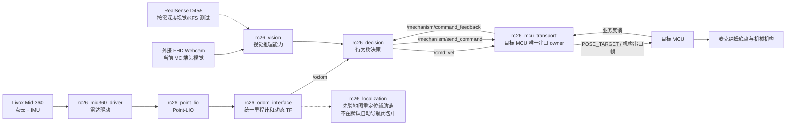
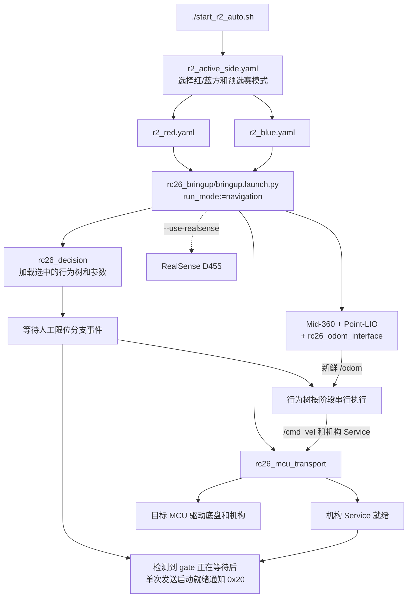

# RC_2026 - R2 自动机器人 ROS2 运行时

> **本项目由西华大学创界 RC 战队视觉算法组开源。**
>
> 这句话表示战队视觉算法组负责将当前项目公开并持续维护，不表示仓库内所有代码、算法和第三方组件都由本组原创。原作者、历史贡献者和上游项目的版权与许可证继续保留，详见 [开源许可](#开源许可与致谢) 和 [THIRD_PARTY_NOTICES.md](THIRD_PARTY_NOTICES.md)。

`RC_2026` 是为 R2 自动机器人准备的一套 ROS 2 运行时。用大白话说，它把机器人身上的激光雷达、相机、底盘和机械臂连接起来，让机器人知道“自己在哪里、现在该做什么、底盘该怎么走、机构什么时候动作”。用专业术语说，它包含传感器驱动、LiDAR-Inertial Odometry、坐标变换、视觉推理、行为树决策、速度控制接口和 MCU 串口执行链。

当前项目只为 **R2 自动机器人** 设计。R1 是手动机器人，不属于本仓库的自动运行时。仓库内不再维护第一方 Web 前端，整车默认以 **headless（无图形界面）** 方式运行；需要看 TF、点云或里程计时，可以临时启动 RViz2，但 RViz2 只负责观察，不是控制和状态权威。

> [!WARNING]
> 本项目可以向真实底盘和机构发送运动指令。第一次启动、修改参数或切换运行模式前，请架空底盘或让机器人处于可靠支撑状态，准备好急停，清空机器人运动范围，并确认只有一个节点在发布 `/cmd_vel`。不要同时运行自动决策、人工遥控和其它运动测试链。

## 一眼看懂这套系统

如果把 R2 想成一个人，可以这样理解：

- Mid-360 和相机是“眼睛”，负责观察环境。
- Point-LIO 和 `rc26_odom_interface` 是“方向感”，持续估计机器人走了多远、转了多少。
- `rc26_decision` 和行为树是“大脑”，按比赛阶段选择下一步动作。
- `/cmd_vel` 和机构 Service 是“大脑发出的动作意图”。
- `rc26_mcu_transport` 是“神经和翻译器”，把 ROS 2 指令转换成 MCU 能理解的串口帧。
- MCU、麦克纳姆底盘和机械机构是“手脚”，负责真正执行动作。

### 常见术语

| 术语 | 大白话解释 | 在本项目中的含义 |
| --- | --- | --- |
| Node（节点） | 一个独立工作的程序 | 雷达驱动、里程计、决策和串口传输都以 ROS 2 节点运行 |
| Topic（话题） | 持续广播的数据频道 | `/odom` 持续发布里程计，`/cmd_vel` 持续发布底盘速度意图 |
| Service（服务） | 发一次请求，等一次答复 | `/mechanism/send_command` 用于下发一次机构命令并返回是否被接受 |
| TF（Transform） | 坐标系之间的实时换算关系 | 用来描述 `odom`、`base_footprint`、`base_link` 和传感器坐标系的关系 |
| Behavior Tree（行为树，BT） | 把任务拆成条件、顺序、重试和回退的流程图 | `rc26_decision` 用它编排比赛阶段和动作顺序 |
| Odometry（里程计） | 机器人相对出发位置走了多远、朝向怎样 | 下游统一通过 `/odom` 读取，运动闭环依赖它 |
| LIO | 激光雷达与 IMU 融合里程计 | Point-LIO 同时使用点云和惯性数据估计运动状态 |
| headless | 不启动本地图形界面 | 正式运行默认不启动 RViz2 或 Web 页面，节省板端资源 |

### 当前真实主运行链



这里最容易产生的误解有三个：

1. `/cmd_vel` 不是直接写电机。它只是 ROS 2 中的速度意图，默认由 `rc26_mcu_transport` 消费，再转换为 `POSE_TARGET` 串口帧交给 MCU。
2. 默认自动导航不是旧式 Nav2 地图规划链。当前正式运动由 `rc26_decision` 内部的 odom 相对闭环动作串行发布 `/cmd_vel`。
3. `rc26_localization` 仍保留先验地图重定位能力，但当前 `start_r2_auto.sh` 的默认导航闭包不会启动旧地图定位、地图服务、路径规划、控制器或速度平滑链。

更精确的架构边界见 [ROS2 工作区架构准则](docs/fitness/architecture_fitness_ros2_workspace/README.md)，当前包级事实见 [后端文档索引](docs/backend/README.md)。

## 技术栈与硬件

### 运行环境

| 层级 | 当前口径 | 说明 |
| --- | --- | --- |
| 操作系统 | Ubuntu 22.04 | 开发和 ROS 2 用户空间基线 |
| ROS 发行版 | ROS 2 Humble | 节点通信、launch、TF、消息和构建工具链 |
| 实机融合环境 | AidLux，Android 13 + Ubuntu 22.04 | R2 板端部署环境 |
| 计算平台 | 犀牛派 X1 / Qualcomm QCS8550 | 当前实机算力板卡 |
| 构建系统 | colcon + ament_cmake + CMake | ROS 2 工作区构建与包管理 |
| 主要语言 | C/C++、Python 3、Bash | 算法与运行时以 C/C++ 为主，装配和工具以 Python/Bash 为主 |
| 配置与编排 | YAML、ROS 2 launch、BehaviorTree.CPP XML | 参数、节点装配和任务流程入口 |

普通 x86_64 Ubuntu 22.04 机器可以用于阅读、开发和部分构建，但这不等于完成实机验收。相机枚举、AidLite、串口、雷达网络、底盘运动和机构动作仍必须在犀牛派 X1/AidLux 与真实 R2 硬件上验证。

### 核心算法与库

| 技术 | 用途 |
| --- | --- |
| Point-LIO | 融合 LiDAR 与 IMU，输出实时里程计和配准点云 |
| small_gicp、PCL、Eigen | 点云配准、近邻搜索、矩阵与几何计算 |
| BehaviorTree.CPP | 编排比赛阶段、条件、动作、重试和回退 |
| OpenCV | 图像处理、检测结果后处理和调试窗口 |
| GTSAM | Point-LIO 实验性闭环优化的构建期依赖，当前按 4.2.0 维护 |
| ONNX Runtime | 非 AidLux 环境下的可选本地推理后端 |
| AidLite | AidLux/X1 环境下优先使用的可选推理后端 |
| librealsense / realsense2_camera | RealSense D455 图像与深度数据接入 |
| RViz2 | 可选的只读现场观察工具，不参与控制决策 |

### 主要硬件

- **Livox Mid-360**：提供三维点云和 IMU 数据，是 Point-LIO 主链的输入。
- **RealSense D455**：按需启动，用于深度视觉任务和 KFS 独立测试；它不是默认 odom 导航的必需设备。
- **外接 FHD Webcam**：当前 MC 武馆区端头视觉使用的相机，正式配置使用稳定的 `/dev/v4l/by-id/` 路径。
- **目标 MCU**：统一接收底盘 `POSE_TARGET` 和机构命令，并返回 ACK 与业务完成反馈。
- **麦克纳姆底盘**：支持 `linear.x`、`linear.y` 和 `angular.z` 全向运动。

### 依赖分层

- **基础必需依赖**：ROS 2 Humble、colcon、ament、PCL、Eigen、OpenCV、yaml-cpp、BehaviorTree.CPP 及各标准 ROS 消息包。
- **算法构建依赖**：`rc26_point_lio` 当前要求 GTSAM 4.2.0；即使实验性闭环默认关闭，构建期仍然需要 GTSAM。
- **实机依赖**：Mid-360 网络、目标 MCU 串口、相机设备、正确的传感器外参和 R2 实机参数。
- **可选视觉后端**：AidLite 和 ONNX Runtime C++ 都是可选编译后端。缺少其中一个时可以使用另一个；两者都缺少时 `rc26_vision` 仍可通过 stub 完成构建，但启动实际推理会明确报“无可用推理后端”，不会生成伪检测结果。

## 仓库结构

```text
RC_2026/
├── docs/                 架构、边界、接口和模块事实的约束真源
├── src/                  R2 自动机器人的 ROS 2 主运行时工作区
├── MCU/                  与目标 MCU 协议/执行相关的 C 源码片段
├── scripts/              开发辅助工具，例如 C/C++ 编译数据库刷新
├── start_r2_auto.sh      自动决策/比赛链快捷入口
├── start_r2_teleop.sh    人工手柄遥控测试入口
├── 开机自启动.txt         AidLux 实机 systemd 部署说明
├── LICENSE               项目组有权授权内容的默认 MIT 许可证
└── THIRD_PARTY_NOTICES.md 第三方与包级许可证说明
```

根目录和 `src/` 中的 `build/`、`install/`、`log/` 都是构建或运行产物，不是设计约束真源，也不应当被当成源码入口。理解系统时先读 `docs/`，再看相应 `src/rc26_*` 包。

## ROS 2 包总览

当前工作区共有 14 个 `rc26_*` 包。

### 装配、决策与接口

| 包 | 大白话职责 | 专业定位 |
| --- | --- | --- |
| [`rc26_bringup`](docs/backend/archive/rc26_bringup/README.md) | 决定一次启动要拉起哪些节点、读哪份参数 | 整车 launch 装配层，不承载算法和比赛策略 |
| [`rc26_decision`](docs/backend/archive/rc26_decision/README.md) | 按比赛流程决定下一步走、转、夹取还是等待 | BehaviorTree.CPP 决策与 odom 相对闭环动作层 |
| [`rc26_interfaces`](docs/backend/archive/rc26_interfaces/README.md) | 定义各包都能看懂的自定义消息和服务 | ROS 2 IDL 契约包，目前保留机构传输与端头检测接口 |

### 里程计、定位与点云

| 包 | 大白话职责 | 专业定位 |
| --- | --- | --- |
| [`rc26_mid360_driver`](docs/backend/archive/rc26_mid360_driver/README.md) | 把 Mid-360 的网络数据送进 ROS 2 | Livox Mid-360 驱动与 `PointCloud2` 发布 |
| [`rc26_sensor_extrinsics`](docs/backend/archive/rc26_sensor_extrinsics/README.md) | 记录传感器实际装在车身什么位置和角度 | R2 静态安装外参 YAML 真源 |
| [`rc26_point_lio`](docs/backend/archive/rc26_point_lio/README.md) | 用点云和 IMU 估计机器人相对运动 | LiDAR-Inertial Odometry 与建图主链 |
| [`rc26_odom_interface`](docs/backend/archive/rc26_odom_interface/README.md) | 把 Point-LIO 输出整理成全车统一坐标和 `/odom` | 里程计归一化、`odom -> base_footprint -> base_link` 动态 TF 权威 |
| [`rc26_sensor_scan`](docs/backend/archive/rc26_sensor_scan/README.md) | 把点云和里程计按时间、坐标对齐 | 点云时空对齐辅助模块，默认自动导航不启动 |
| [`rc26_localization`](docs/backend/archive/rc26_localization/README.md) | 把实时点云与先验地图对齐，估计地图中的位置 | SAC-IA/GICP 重定位与 `map -> odom` 权威，非默认自动导航闭包 |
| [`rc26_small_gicp`](docs/backend/archive/rc26_small_gicp/README.md) | 提供高效的点云“找重合位置”能力 | 内置 small_gicp 点云配准基础库 |

### 执行、控制与基础通信

| 包 | 大白话职责 | 专业定位 |
| --- | --- | --- |
| [`rc26_mcu_transport`](docs/backend/archive/rc26_mcu_transport/README.md) | 统一打开目标 MCU 串口并收发底盘、机构命令 | `/cmd_vel` 消费、可靠 ACK、raw feedback 与串口健康权威 |
| [`rc26_telecontrol`](docs/backend/archive/rc26_telecontrol/README.md) | 用手柄人工测试 R2 的全向底盘和推杆 | 非比赛自动链的人工遥控测试包 |
| [`rc26_serial`](docs/backend/archive/rc26_serial/README.md) | 提供拆包、校验、重试等串口基础能力 | MCU 二进制协议基础库，不拥有比赛策略 |

### 视觉

| 包 | 大白话职责 | 专业定位 |
| --- | --- | --- |
| [`rc26_vision`](docs/backend/archive/rc26_vision/README.md) | 从相机画面里找端头和 KFS，并结合深度给出目标信息 | 视觉配置、YOLO 推理、后处理、深度采样和受限动作测试能力 |

四条边界必须始终记住：

- `rc26_bringup` 只负责“怎么装起来”，不负责算法和比赛逻辑。
- `rc26_decision` 负责“接下来做什么”，不直接持有串口或实现设备协议。
- `rc26_mcu_transport` 是目标 MCU 物理串口的唯一 owner，其他包通过 ROS 2 接口使用它。
- `rc26_odom_interface` 维护统一 `/odom` 与动态基座 TF，不能再启动第二个节点发布相同动态 TF 边。

## 从启动脚本到机器人真正运动

默认比赛入口是根目录的 [`start_r2_auto.sh`](start_r2_auto.sh)。脚本负责把常用 launch 参数组织好，但不会把红蓝路线和比赛策略写死在 Bash 中。



实际顺序可以概括为：

1. `start_r2_auto.sh` 读取 [`r2_active_side.yaml`](src/rc26_bringup/config/r2_active_side.yaml)。
2. selector 选择完整的 [`r2_red.yaml`](src/rc26_bringup/config/r2_red.yaml) 或 [`r2_blue.yaml`](src/rc26_bringup/config/r2_blue.yaml)，并确定 first/second 预选赛入口。
3. `bringup.launch.py` 装配 `rc26_mcu_transport`、odom 主链、`rc26_decision` 和按需 RealSense。
4. 行为树等待相应人工限位/握手事件，再串行执行导航、视觉、等待和机构动作。
5. odom 闭环动作根据 `/odom` 误差生成 `/cmd_vel`；transport 限幅、看门狗处理后，将它编码成 MCU `POSE_TARGET`。
6. 机构动作通过 `/mechanism/send_command` 下发；通用 ACK 只表示命令已被传输层接受，真正动作完成要继续匹配 `/mechanism/command_feedback` 中的业务反馈。

`start_r2_auto.sh` 默认不启动 RealSense D455，但默认自动决策和比赛主链仍会启动。当前 MC 端头视觉使用外接 FHD Webcam；只有使用需要 D455 的视觉树、深度任务或独立视觉调试时才传 `--use-realsense`。

标准红蓝配置当前把整棵行为树之前的 `startup_wait_for_odom` 设为 `false`，因此行为树节点可以立即创建并进入人工 gate。这个设置不等于“没有里程计也能开车”：`OdomDriveX`、`OdomDriveY`、转向和 heading 等实际运动动作仍会检查新鲜真实 `/odom`，没有有效里程计时必须保持停车等待或按自身超时语义结束。

比赛路线距离、行为树阶段和完整 MCU 命令/反馈编号变化频繁，不在根 README 重复维护。当前事实请看：

- [bringup 装配说明](docs/backend/archive/rc26_bringup/README.md)
- [决策与行为树说明](docs/backend/archive/rc26_decision/README.md)
- [ROS 2 接口索引](docs/middle/openapi.yaml)
- [机构传输契约](docs/middle/modules/mechanism.yaml)

## 安装与编译

### 1. 准备 Ubuntu 和 ROS 2

以下命令以 Ubuntu 22.04 + ROS 2 Humble 为基线。请先按 ROS 2 官方文档安装完整 Humble 环境，然后安装常用工作区工具：

```bash
sudo apt update
sudo apt install -y python3-colcon-common-extensions python3-rosdep
source /opt/ros/humble/setup.bash
```

如果这台机器还没有初始化过 `rosdep`：

```bash
sudo rosdep init
rosdep update
```

`sudo rosdep init` 一台机器通常只需要执行一次；如果提示已经存在 sources list，保留现有配置并直接执行 `rosdep update`。

### 2. 克隆到推荐路径

AidLux 实机当前按 `/home/aidlux/RC_2026` 维护：

```bash
cd /home/aidlux
git clone https://github.com/potato484/RC_2026.git
cd /home/aidlux/RC_2026
```

如果把仓库放到其他目录，源码可以继续构建，但必须检查红蓝配置中的绝对路径。当前 `r2_runtime.paths.prior_pcd_file`、`behavior_tree_file` 以及部分部署资产按 `/home/aidlux/RC_2026` 编写；路径不存在时，对应配置加载方或运行节点会明确报错，不会静默猜测新位置。

> [!IMPORTANT]
> 当前红蓝配置引用的 `src/rc26_point_lio/PCD/class_plus.pcd` 是现场先验点云，`src/rc26_point_lio/PCD/` 整个目录被 `.gitignore` 排除，公开克隆不会包含这份 47 MB 左右的本地资产。只构建源码或运行默认 odom-only 导航不等于已经具备地图定位资产；需要使用 `rc26_localization`、地图联调或依赖该先验点云的流程时，请先放入有权使用的 PCD，并把红蓝 YAML 的 `prior_pcd_file` 改成当前机器上的真实绝对路径。不要把缺失的现场地图提交为来源不明的公共资产。

### 3. 安装可自动解析的依赖

```bash
source /opt/ros/humble/setup.bash
cd /home/aidlux/RC_2026
rosdep install --from-paths src --ignore-src --rosdistro humble -r -y
```

`rosdep` 负责标准 ROS 2 和 Ubuntu 依赖，但不能替代板端 SDK 与所有算法库的手工安装：

- GTSAM 当前按 **4.2.0 源码安装到 `/usr/local`** 的口径维护，参见 [`rc26_point_lio` 编译说明](src/rc26_point_lio/README.md#编译)。
- AidLite 来自 AidLux 板端环境，不由 `rosdep` 安装。
- ONNX Runtime C++ 是可选本地推理后端，构建脚本会探测头文件和动态库。
- RealSense D455 需要 `realsense2_camera` 和 librealsense；只跑默认无 D455 自动链时不必启动相机节点。

### 4. 构建当前全部 14 个包

仓库统一使用低并发顺序构建，避免犀牛派 X1 上资源瞬时占用过高：

```bash
cd /home/aidlux/RC_2026
source /opt/ros/humble/setup.bash
MAKEFLAGS='-j2 -l2' colcon build \
  --symlink-install \
  --executor sequential \
  --parallel-workers 1 \
  --packages-select \
  rc26_interfaces \
  rc26_serial \
  rc26_small_gicp \
  rc26_mid360_driver \
  rc26_sensor_extrinsics \
  rc26_point_lio \
  rc26_odom_interface \
  rc26_sensor_scan \
  rc26_localization \
  rc26_mcu_transport \
  rc26_vision \
  rc26_decision \
  rc26_telecontrol \
  rc26_bringup
source install/setup.bash
```

只修改某个包时，也继续使用同一命令形式，把 `--packages-select` 后的列表缩小到受影响包及必要闭包。仓库当前没有 GitHub Actions 或其它仓库级 CI，包级构建和实机 launch 需要维护者手动验收。

## 第一次安全启动

### 启动前检查

1. 打开 [`r2_active_side.yaml`](src/rc26_bringup/config/r2_active_side.yaml)，确认 `active_side`、`preselection_mode` 和选择的运行配置符合现场任务。
2. 确认当前任务实际使用的 PCD、行为树和设备路径在当前机器真实存在；公开克隆默认不包含现场 `class_plus.pcd`。
3. 确认 `/dev/ttyUSB0` 或覆盖后的 MCU 串口存在，当前用户具有串口权限。
4. 确认 Mid-360 与主机网络配置正确；当前默认口径使用雷达 `192.168.1.140`、主机 `192.168.1.50`。
5. 如果启用视觉，确认 D455 或固定 FHD Webcam 路径存在，并确认推理后端可用。
6. 停止遥控、视觉动作测试、独立 heading 和其它 `/cmd_vel` 发布者。
7. 架空底盘或确保运动区域安全，准备急停。

先只打印命令，不启动任何 ROS 2 节点：

```bash
cd /home/aidlux/RC_2026
./start_r2_auto.sh --dry-run
```

检查输出中的工作区、红蓝方、运行配置、行为树、MCU 串口和可选相机参数。确认无误后再运行：

```bash
./start_r2_auto.sh
```

需要 D455 和 RViz2 时显式开启：

```bash
./start_r2_auto.sh --use-realsense --use-rviz
```

前台运行时按 `Ctrl+C` 停止。停止后继续观察几秒，确认 transport 已发送停车帧且底盘和机构进入安全状态。

## 常用运行入口

### 自动比赛链

```bash
./start_r2_auto.sh
./start_r2_auto.sh --dry-run
./start_r2_auto.sh --use-realsense
./start_r2_auto.sh --use-rviz
```

完整参数见：

```bash
./start_r2_auto.sh --help
```

### 人工手柄遥控

遥控前必须停止自动决策和其它 `/cmd_vel` 发布者。建议首次实机测试启用 deadman 安全键：

```bash
./start_r2_teleop.sh --dry-run --require-deadman
./start_r2_teleop.sh --require-deadman
```

该脚本会启动 `rc26_mcu_transport`、`joy_node`、遥控节点和前后推杆 sidecar。它是人工测试入口，不应与 `start_r2_auto.sh` 同时运行。

### 纯建图/里程计联调

```bash
source install/setup.bash
ros2 launch rc26_bringup bringup.launch.py \
  run_mode:=mapping \
  pure_mapping_mode:=true \
  use_decision:=false
```

建图输出、PCD 保存和地图后处理见 [`rc26_point_lio`](src/rc26_point_lio/README.md)。mapping 是调试/建图入口，不会改变默认 navigation 的最小装配边界。

### KFS 视觉测试

下面的默认命令只启动 RealSense 和视觉 overlay，不发布底盘动作：

```bash
source install/setup.bash
ros2 launch rc26_vision test_kfs_vision.launch.py action_enable:=false
```

`action_enable:=true` 会进入真实底盘/机构测试链，只能在已停用自动决策、遥控和其它 `/cmd_vel` 发布者后，由熟悉现场安全边界的维护者使用。详细阶段与超时见 [`rc26_vision` 文档](docs/backend/archive/rc26_vision/README.md)。

### 开机自启动

AidLux 实机的 systemd 服务安装、状态、日志、重启和卸载命令见 [`开机自启动.txt`](开机自启动.txt)。服务名为 `r2-auto.service`：

```bash
systemctl status r2-auto.service
journalctl -u r2-auto.service -f
sudo systemctl stop r2-auto.service
sudo systemctl restart r2-auto.service
```

## 关键接口

ROS 2 的 Topic 和 Service 就是当前后端公开接口。下表是根 README 的导航摘要，字段、类型和精确语义以 [`docs/middle/openapi.yaml`](docs/middle/openapi.yaml) 及模块契约为准。

| 接口 | 类型 | 生产者 | 主要消费者 | 含义 |
| --- | --- | --- | --- | --- |
| `/odom` | `nav_msgs/msg/Odometry` | `rc26_odom_interface` | `rc26_decision` 等运动动作 | 统一 odom 坐标系下的机器人位姿和速度 |
| `/cmd_vel` | `geometry_msgs/msg/Twist` | 当前串行生效的决策/遥控/测试动作 | `rc26_mcu_transport` | 麦克纳姆底盘速度意图，不是电机原始命令 |
| `/mechanism/send_command` | `rc26_interfaces/srv/SendMechanismTransportCommand` | `rc26_mcu_transport` 提供 Service | 决策或受限测试节点调用 | 下发一次 raw 机构命令，可选择是否等待通用 ACK |
| `/mechanism/command_feedback` | `rc26_interfaces/msg/MechanismTransportFeedback` | `rc26_mcu_transport` | `rc26_decision`、视觉测试等 | MCU 上行业务反馈，需按命令状态机和 `seq` 匹配 |
| `/vision/tip_detections` | `rc26_interfaces/msg/TipDetectionArray` | `rc26_vision` tip 定位链 | 外部只读消费者 | 稳定的端头检测结果契约 |
| `odom -> base_footprint -> base_link` | 动态 TF | `rc26_odom_interface` | 全部坐标变换消费者 | R2 自动导航主链的动态基座 TF |
| `map -> odom` | TF | `rc26_localization`（启用时） | 地图坐标消费者 | 先验地图定位权威，不属于默认自动导航闭包 |

对应契约：

- [导航 `/cmd_vel` 契约](docs/middle/modules/navigation.yaml)
- [机构 Service/Topic 契约](docs/middle/modules/mechanism.yaml)
- [视觉检测契约](docs/middle/modules/vision.yaml)
- [定位输出契约](docs/middle/modules/localization.yaml)

### ACK 不等于动作完成

调用 `/mechanism/send_command` 且 `wait_ack=true` 时，`accepted=true` 只表示目标 MCU 返回了通用 ACK，不代表机械臂或推杆已经完成物理动作。需要确认完成的行为树节点必须继续等待 `/mechanism/command_feedback` 中对应 `feedback_id` 和 `seq`。`wait_ack=false` 只用于明确设计成 no-ack 的单次通知，例如启动就绪 `0x20`。

## 运行观察与排障

### 基本观察命令

```bash
# /odom 是否持续更新
ros2 topic hz /odom

# 谁在发布和订阅 /cmd_vel，实机运动前必须确认发布权唯一
ros2 topic info /cmd_vel --verbose

# 查看一次机构业务反馈
ros2 topic echo --once /mechanism/command_feedback

# 确认机构服务类型和是否存在
ros2 service type /mechanism/send_command

# 检查动态 TF
ros2 run tf2_ros tf2_echo odom base_footprint
```

### 常见问题

| 现象 | 优先检查 |
| --- | --- |
| 行为树启动了但机器人不走 | `/odom` 是否新鲜、运动动作是否在等待、`/cmd_vel` 是否发布、transport 是否已连接 MCU |
| 完全没有 `/odom` | Mid-360 网络和数据流、驱动节点、Point-LIO IMU 初始化、`rc26_odom_interface` 输入 topic |
| 串口反复重连或 Service 不存在 | `/dev/ttyUSB0` 是否存在、用户是否属于 `dialout`、波特率是否为现场真实值、是否有第二个进程占用串口 |
| Mid-360 没有数据 | 主机与雷达 IP、网卡配置、防火墙、雷达数据流状态；需要时使用 `--recover-mid360-stream` |
| FHD Webcam 打不开 | 检查 `/dev/v4l/by-id/` 固定路径；不要把同设备的 metadata `video-index1` 当图像源 |
| D455 启动失败或选错设备 | 使用 `rs-enumerate-devices` 核对设备；需要时通过 launch 参数覆盖真实序列号 |
| 视觉节点提示无可用推理后端 | 查看启动日志中的 AidLite/ONNX Runtime 编译状态和 `engine: auto` 选择结果 |
| bringup 报 PCD/行为树路径不存在 | 检查红蓝 YAML 中是否仍是 `/home/aidlux/RC_2026` 以外的旧绝对路径 |
| 底盘动作互相打架或突然加速 | 立即急停，然后用 `ros2 topic info /cmd_vel --verbose` 排查多个发布者 |
| RViz 没画面但机器人链正常 | 正式运行默认 headless；检查 RViz Fixed Frame、topic 和 QoS，不要让显示问题反向改变运行时权威 |

更具体的排障信息放在各包 README、launch 文件和实机操作记录中。根目录不维护第二套容易过期的完整调试手册。

## 当前能力边界

- 本仓库是 R2 自动机器人运行时，不是 R1 手动机器人项目。
- 仓库没有第一方 Web 前端；外部 RViz2、Foxglove 或其它工具只能只读消费 ROS 2 输出。
- 默认自动导航使用 `rc26_decision` 内部 odom 相对闭环，不启动旧 Nav2 地图服务、全局规划器、局部控制器和速度平滑链。
- `rc26_localization`、`rc26_sensor_scan` 和建图能力仍可用于独立联调，但不能据此把它们写成默认比赛闭包。
- 缺少 AidLite 和 ONNX Runtime 时允许构建视觉 stub，不代表视觉推理可运行。
- x86_64 上编译通过不替代犀牛派 X1/AidLux、雷达、相机、串口、底盘和机构的实机验收。
- 仓库级 CI/CD 已删除；当前验收由包级构建、非运动 dry-run、受控 launch 和实机测试组成。

## 文档与贡献

`docs/` 是本项目的约束中心。准备修改代码前，请按以下顺序建立上下文：

1. 先读 [共同准则](docs/fitness/README.md) 和 [后端入口](docs/backend/README.md)。
2. 再读对应的 [`docs/backend/archive/<pkg>/README.md`](docs/backend/README.md)。
3. 涉及 Topic、Service、字段或桥接语义时，再读 [ROS 2 接口索引](docs/middle/openapi.yaml) 和对应模块 YAML。
4. 回到 `src/` 核对当前代码和真实接口后再修改。
5. 修改职责、输入输出、边界或接口时，同步更新对应 `docs/` 文档。

代码修改至少应按受影响包执行：

```bash
MAKEFLAGS='-j2 -l2' colcon build \
  --symlink-install \
  --executor sequential \
  --parallel-workers 1 \
  --packages-select <pkg...>
```

提交前确认：构建命令可复现、实机动作有安全前提、没有引入第二个串口或 TF 权威、没有让多个 `/cmd_vel` 发布者同时运行，并把新的真实行为简要回写到对应 `docs/` 模块。

## 开源许可与致谢

本项目由 **西华大学创界 RC 战队视觉算法组** 开源。项目组有权授权且没有单独许可证声明的内容，默认按 [MIT License](LICENSE) 提供，可用于学习、研究、修改和再发布，但必须保留版权和许可声明，软件按“原样”提供且不附带担保。

仓库是混合许可集合。包内 `package.xml`、文件头和上游许可证可能使用 Apache-2.0、BSD-3-Clause 或单独的 MIT 版权声明；这些更具体的声明优先于根 MIT。完整映射和上游版权见 [THIRD_PARTY_NOTICES.md](THIRD_PARTY_NOTICES.md)。

感谢以下项目及其作者为本项目提供基础能力：

- [ROS 2](https://docs.ros.org/en/humble/)
- [Point-LIO](https://github.com/hku-mars/Point-LIO) 及其 LOAM/LIO 上游贡献者
- [small_gicp](https://github.com/koide3/small_gicp)，Kenji Koide
- BehaviorTree.CPP、PCL、Eigen、OpenCV、GTSAM、ONNX Runtime、librealsense 及相关开源社区

使用或再分发本仓库时，请同时阅读：

- [根 MIT 许可证](LICENSE)
- [第三方与包级许可说明](THIRD_PARTY_NOTICES.md)
- [Apache-2.0 许可证副本](LICENSES/Apache-2.0.txt)
- [Point-LIO BSD-3-Clause 许可证副本](LICENSES/BSD-3-Clause-Point-LIO.txt)
- [small_gicp MIT 许可证副本](LICENSES/MIT-small-gicp.txt)
